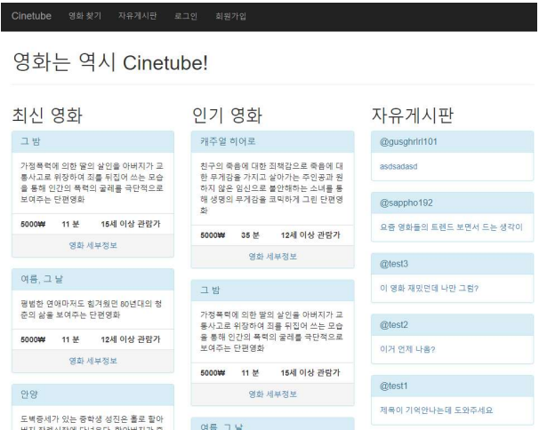

# CineTube

[[Term project report.pdf](report.pdf)]

# 동작 환경

#### 웹 서버

Microsoft Azure의 App Service (.NET Framework v4.7)

#### 파일(영화) 서버

Microsoft Azure의 스토리지 계정(Blob Service)

#### DB 서버

Microsoft SQL Server v14.0.2002

#### 운영체제

Microsoft Windows 10 Pro

# 개발 환경

####	웹 서버

C# ASP.Net Core v2.1 with MVC(Razor)

####	개발 프로그램

Microsoft Visual Studio Community 2017 (v15.9.4)

####	DBMS

Microsoft SQL Server Management Studio v17.9.1

####	Data Modeling Software

ER-Win

#### 버전 관리

git (Github)

# 요구 분석

웹에서 영화를 제공하는 Cinetube라는 회사는 회원이 원하는 영화를 대여/판매해준다.

회원과 관리자는 같은 회원이나 등급으로서 구분된다.

관리자는 회원 목록을 확인할 수 있다.

영화에는 가격, 이름, 감독명, 장르, 제작연도, 개봉연도, 제작사 정보 등이 들어가있다.

회원은 영화를 대여/구매할 수 있고 결제한 영화를 시청 및 리뷰할 수 있으며 미리 거래에 필요한 금액을 충전할 수 있다.

(대여인 경우 구매보다 가격이 저렴함)

회원은 해당 영화에 한줄평과 평점을 한 영화에 한 번만 남길 수 있다.

회원은 본인의 개인정보, 결제한 영화, 충전 내역을 확인할 수 있다.

사이트에서는 영화명, 감독명, 개봉연도, 장르, 배우명 등으로 검색을 할 수 있다.

대여와 구매는 둘 다 거래로 취급되며 거래일시, 금액, 거래한 영화, 이용가능 기간 정보가 공통적으로 들어가며,

대여의 경우는 이용가능 기간이 특정기간(예: 1주일)까지 정해져 있고 구매의 경우에는 100년뒤까지(예: 2099년 12월 31일) 이용가능하게 한다.

회원들은 자유게시판을 통해 잡담(게시글 작성, 댓글 작성)을 나눌 수 있으며 열람 자체는 로그인하지 않아도 가능하다. 
